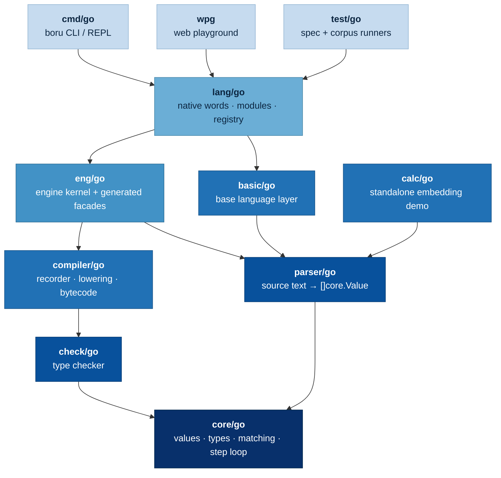
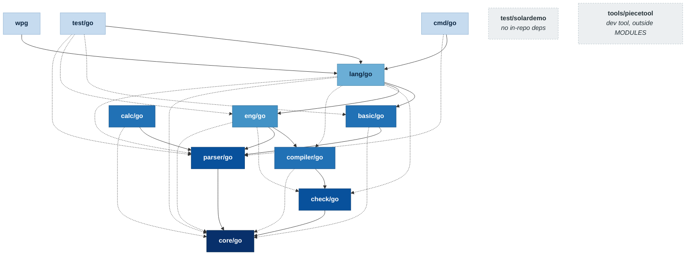

# Go module graph and per-module coverage

> **Status: measured snapshot.** Nothing here proposes a change. It is the
> Go side of the repository as it stands at commit `22a567b` (2026-08-11):
> which modules exist, what each one requires, and how well each one is
> covered by tests — both under the repo-wide ADR-008 gate and by its own
> suite alone.
>
> The **module edges are not hand-drawn.** They are read from `go.work` and
> every `go.mod`, the same ground truth `kg/gomod.boru` reads to build the
> knowledge graph's module view ([kg/out/graph.md](../kg/out/graph.md)), and
> by the same rule: **only direct requires become edges.** An `// indirect`
> line records what the module graph drags in, not what the module was
> written against, and conflating the two makes every module look like it
> depends on everything.
>
> Scope is **Go only**. The TypeScript twins (`core/ts`, `parser/ts`,
> `basic/ts`, `eng/ts`) and their gates are out of scope here; see
> [GO-TS-PARITY.0.md](GO-TS-PARITY.0.md) and
> [ENG-COVERAGE-PARITY.0.md](ENG-COVERAGE-PARITY.0.md).

## 1. Inventory

Fourteen Go modules exist in the tree. Twelve are workspace members that
also form the `MODULES` list the root `Makefile` builds, tests and gates;
two sit outside that list deliberately.

| Module | Module path | In `go.work` | In `MODULES` | Pkgs | Source `.go` | Test `.go` |
|---|---|:--:|:--:|--:|--:|--:|
| `core/go` | `github.com/boru-lang/boru/core/go` | ✓ | ✓ | 1 | 126 | 167 |
| `parser/go` | `github.com/boru-lang/boru/parser/go` | ✓ | ✓ | 1 | 8 | 21 |
| `check/go` | `github.com/boru-lang/boru/check/go` | ✓ | ✓ | 1 | 11 | 17 |
| `compiler/go` | `github.com/boru-lang/boru/compiler/go` | ✓ | ✓ | 1 | 11 | 26 |
| `basic/go` | `github.com/boru-lang/boru/basic/go` | ✓ | ✓ | 1 | 21 | 11 |
| `eng/go` | `github.com/boru-lang/boru/eng/go` | ✓ | ✓ | 3 | 24 | 121 |
| `lang/go` | `github.com/boru-lang/boru/lang/go` | ✓ | ✓ | 12 | 296 | 701 |
| `cmd/go` | `github.com/boru-lang/boru/cmd/go` | ✓ | ✓ | 39 | 128 | 218 |
| `calc/go` | `github.com/boru-lang/boru/calc/go` | ✓ | ✓ | 2 | 4 | 5 |
| `wpg` | `github.com/boru-lang/boru/wpg` | ✓ | ✓ | 1 (+`wasm`) | 3 | 3 |
| `test/go` | `github.com/boru-lang/boru/test/go` | ✓ | ✓ | 7 | 5 | 45 |
| `test/solardemo` | `github.com/boru-lang/boru/test/solardemo` | ✓ | ✓ | 1 | 1 | 1 |
| `tools/piecetool` | `github.com/boru-lang/boru/tools/piecetool` | ✓ | ✗ | 1 | 7 | 0 |
| `editors/tree-sitter/bindings/go` | `github.com/tree-sitter/tree-sitter-boru` | ✗ | ✗ | 1 | 1 | 1 |

Two modules are outside the gated set on purpose:

- **`tools/piecetool`** is a developer tool (the four-piece split's
  inventory/rename/facade generator, `design/ENG-FOUR-PIECE.0.md`). Its own
  `go.mod` says why it is absent from `MODULES`: its statements stay out of
  the repo-wide ADR-008 coverage universe that every *shipped* module must
  satisfy. It has no tests, and under the current arrangement that is the
  intended state, not a gap.
- **`editors/tree-sitter/bindings/go`** is not a workspace member at all and
  does not even carry a `boru-lang` module path — it is the Go binding
  published under `github.com/tree-sitter/tree-sitter-boru`, on `go 1.22`
  while every other module is on `go 1.24.7`.

`wpg/wasm` is `//go:build js && wasm`, so it is invisible to any
host-platform `go test` run and contributes nothing to either coverage
column below. It is built separately by `make -C wpg wasm` (and in CI).

## 2. The dependency spine

Twelve of the twenty-five direct `require` edges are load-bearing; the other
thirteen are already implied by transitivity. Dropping the implied ones
leaves the spine — the shape the architecture actually has:



Depth from `core/go` gives six layers:

| Layer | Modules |
|---|---|
| L0 | `core/go` · (`test/solardemo`, `tools/piecetool` — no in-repo deps) |
| L1 | `check/go` · `parser/go` |
| L2 | `basic/go` · `calc/go` · `compiler/go` |
| L3 | `eng/go` |
| L4 | `lang/go` |
| L5 | `cmd/go` · `test/go` · `wpg` |

## 3. Every declared edge

The full picture, with the thirteen transitively-implied requires drawn
dotted. A dotted edge is not redundant clutter in the `go.mod` — pinning a
module you import directly is correct even when a sibling already pulls it
in — but it is not structure, and reading the graph without that distinction
makes `lang/go` look like it sits on six independent pillars when it sits on
two.



Solid = load-bearing (transitive reduction). Dotted = declared but already
implied.

### Edge table

`cmd/go` and `wpg` are the two modules whose `go.mod` marks in-repo requires
`// indirect`; those are listed separately because they are *not* edges by
the rule above.

| Module | Direct in-repo requires | Marked `// indirect` | Required by (direct) |
|---|---|---|---|
| `core/go` | — | — | `basic/go`, `calc/go`, `check/go`, `compiler/go`, `eng/go`, `lang/go`, `parser/go` |
| `parser/go` | `core/go` | — | `basic/go`, `calc/go`, `cmd/go`, `eng/go`, `lang/go`, `test/go` |
| `check/go` | `core/go` | — | `compiler/go`, `eng/go`, `lang/go` |
| `compiler/go` | `check/go`, `core/go` | — | `eng/go`, `lang/go` |
| `basic/go` | `core/go`, `parser/go` | — | `lang/go`, `test/go` |
| `eng/go` | `check/go`, `compiler/go`, `core/go`, `parser/go` | — | `lang/go`, `test/go` |
| `lang/go` | `basic/go`, `check/go`, `compiler/go`, `core/go`, `eng/go`, `parser/go` | — | `cmd/go`, `test/go`, `wpg` |
| `cmd/go` | `lang/go`, `parser/go` | `basic/go`, `check/go`, `compiler/go`, `core/go` | — |
| `calc/go` | `core/go`, `parser/go` | — | — |
| `wpg` | `lang/go` | `basic/go`, `eng/go` | — |
| `test/go` | `basic/go`, `eng/go`, `lang/go`, `parser/go` | — | — |
| `test/solardemo` | — | — | — |
| `tools/piecetool` | — | — | — |

### Third-party surface

The layering shows up just as sharply in external dependencies. The kernel
is nearly dependency-free; the weight lands in `lang/go` and `cmd/go`.

| Module | Direct external requires | Notes |
|---|--:|---|
| `core/go` | 1 | `cockroachdb/apd/v3` only — the decimal type |
| `check/go` | 0 | pure over `core/go` |
| `compiler/go` | 0 | pure over `check/go` + `core/go` |
| `parser/go` | 2 | `apd`, `tabnas/jsonic/go` |
| `basic/go` | 2 | `apd`, `tabnas/parser/go` |
| `eng/go` | 1 | `apd` |
| `calc/go` | 0 | — |
| `wpg` | 0 | everything via `lang/go` |
| `test/go` | 0 | everything via the modules under test |
| `test/solardemo` | 0 | standard library only |
| `lang/go` | 29 | the content-type/format layer (tabnas codecs, `gojq`, `ojg`, `xpath`, `sqlite`, …) |
| `cmd/go` | 12 | the terminal layer (`charmbracelet/*`, `readline`, `x/crypto`, `x/term`) |
| `tools/piecetool` | 1 | `golang.org/x/tools` |
| `editors/tree-sitter/bindings/go` | 1 | `smacker/go-tree-sitter` — outside `go.work`, so outside the layering above |

## 4. Coverage

### 4.1 Two different questions

"How well is this module tested" has two answers in this repo, and they are
far apart. Both are real; they measure different things.

**Merged (the ADR-008 contract).** `make cover-gate` runs *every* module's
tests with `-coverpkg` spanning the whole repo, then merges the per-module
profiles block-by-block, taking the maximum hit count. A statement counts as
covered when **any** suite reaches it — `lang`'s tests legitimately cover
`eng`, and the spec corpus in `test/go` covers both. The floor is 100% of
reachable statements, and the sole exclusion is a provably-unreachable
defensive guard carrying an inline `//covergate:allow <reason>` comment on
its opening line. This is the number the repo contracts on.

**Standalone (what each module proves on its own).** Each module profiled by
its **own** suite alone, `-coverpkg` scoped to its own package tree, nothing
else contributing. This is the harder question, and the honest one for a
module that is meant to stand as an independent artifact: `core/go` is
published as a module in its own right, so coverage it only gets from
`lang/go`'s tests is coverage its own consumers cannot rely on.

The gap between the two columns is the point of the standalone gates.

### 4.2 The gates and their floors

Six coverage gates exist. Five are per-module standalone gates; one is the
merged repo-wide contract.

| Gate | Target | Floor | Kind |
|---|---|--:|---|
| `make cover-gate` | all modules, merged | **100** | hard contract (ADR-008) |
| `make cover-gate-core` | `core/go` alone | **100** | hard |
| `make cover-gate-parser` | `parser/go` alone | **100** | hard |
| `make cover-gate-eng` | `eng/go` alone | 84 | ratchet → 100 |
| `make cover-gate-compiler` | `compiler/go` alone | 62 | ratchet → 100 |
| `make cover-gate-check` | `check/go` alone | 51 | ratchet → 100 |

A **ratchet** floor may only rise, and only in the same change that raises
the coverage. Two of the three have been deliberately *re-based downward*,
each time because the measurement universe changed rather than because
coverage regressed:

- `ENG_GATE_FLOOR` re-based at the four-piece Stage 4 cut, when the
  interpreter core's statements and ~120 kernel test files moved to
  `core/go` and took their incidental eng-side coverage with them.
- `CHECK_GATE_FLOOR` re-based at the 2026-08-08 carrier-lattice move, when
  492 statements left `check` for `core` *with their tests* — a move, not a
  copy, so the merged gate was untouched and not one covered statement was
  lost. Those 492 were better covered than check's average (77% against
  56%), so removing them lowered the ratio: 1499/2672 = 56.1% before,
  1122/2180 = 51.5% after.

`basic/go`, `lang/go`, `cmd/go`, `calc/go`, `wpg`, `test/go` and
`test/solardemo` have **no standalone gate** — they are held only by the
merged 100% contract.

### 4.3 Where the gates run

`make cover-gate` is a **local pre-commit gate**, invoked from the checklist
in `CLAUDE.md`. It is *not* in `.github/workflows/ci.yml`: CI runs `make
vet`, `make lint`, `make test`, `make parser-parity`, the bytecode race and
args-aliasing gates, `make -C kg verify` and an advisory `make vuln`, but
nothing that invokes the coverage gate. `make parser-parity` is the one
coverage-bearing check CI does run, and it covers `parser/go` only.

### 4.4 Merged coverage — the ADR-008 contract

`make cover-gate` at `22a567b`, go1.24.7 linux/amd64. **PASS**: every module
at 100.0%, 69,970 reachable statements, 334 statements allowlisted across
301 `//covergate:allow` blocks.

| Module | Statements | Covered | Coverage |
|---|--:|--:|--:|
| `core/go` | 14,510 | 14,510 | 100.0% |
| `lang/go` | 27,351 | 27,351 | 100.0% |
| `cmd/go` | 12,604 | 12,604 | 100.0% |
| `compiler/go` | 4,586 | 4,586 | 100.0% |
| `basic/go` | 3,277 | 3,277 | 100.0% |
| `eng/go` | 2,325 | 2,325 | 100.0% |
| `check/go` | 2,182 | 2,182 | 100.0% |
| `parser/go` | 1,679 | 1,679 | 100.0% |
| `test/go` | 1,102 | 1,102 | 100.0% |
| `calc/go` | 199 | 199 | 100.0% |
| `test/solardemo` | 108 | 108 | 100.0% |
| `wpg/serve` | 47 | 47 | 100.0% |
| **TOTAL** | **69,970** | **69,970** | **100.0%** |

Two things to read carefully in that table.

`wpg` appears as **`wpg/serve`**, not `wpg`. covergate buckets an
instrumented file by its first two path segments after the module prefix
(`moduleOf` in `test/go/covergate/main.go`), which is exactly right for
`<name>/go` modules and splits the two flat ones by package instead.
`wpg/wasm` is absent entirely — it is `//go:build js && wasm`, so no
host-platform `go test` ever reaches it, in this column or any other.

`tools/piecetool` is absent because it is not in `MODULES`. Its seven source
files and zero test files are outside the ADR-008 universe by design.

Statement weight is concentrated: `lang/go` alone is 39% of the repo's
reachable statements, `core/go` 21%, `cmd/go` 18% — three modules carry 78%
of the total.

### 4.5 Standalone coverage — what each module proves alone

Each module profiled by its own suite only, `-coverpkg` scoped to its own
package tree, analysed by `test/go/covergate` so the `//covergate:allow`
exclusions apply exactly as the repo's gates apply them. The five modules
that have a standalone gate were cross-checked by running the gate target
itself; the figures agree exactly.

| Module | Standalone | Covered / total | Merged | Floor | Headroom |
|---|--:|--:|--:|--:|--:|
| `core/go` | **100.0%** | 14,510 / 14,510 | 100.0% | 100 (hard) | 0.0 |
| `parser/go` | **100.0%** | 1,679 / 1,679 | 100.0% | 100 (hard) | 0.0 |
| `cmd/go` | **100.0%** | 12,604 / 12,604 | 100.0% | — | — |
| `test/go` | **100.0%** | 1,102 / 1,102 | 100.0% | — | — |
| `calc/go` | **100.0%** | 199 / 199 | 100.0% | — | — |
| `test/solardemo` | **100.0%** | 108 / 108 | 100.0% | — | — |
| `wpg/serve` | **100.0%** | 47 / 47 | 100.0% | — | — |
| `lang/go` | 98.9% | 27,054 / 27,351 | 100.0% | — | — |
| `eng/go` | 93.6% | 2,173 / 2,321 | 100.0% | 84 (ratchet) | **+9.6** |
| `compiler/go` | 63.0% | 2,885 / 4,581 | 100.0% | 62 (ratchet) | +1.0 |
| `check/go` | 51.5% | 1,122 / 2,180 | 100.0% | 51 (ratchet) | +0.5 |
| `basic/go` | **44.9%** | 1,470 / 3,274 | 100.0% | — | — |

**Seven of the twelve modules are fully self-sufficient** — they prove
themselves without help from any other suite. That includes both modules
whose gates are hard 100s (`core/go`, `parser/go`) and five that reach it
with no standalone gate at all.

Note the denominators drift by a few statements between the two columns for
the modules that are not at 100%: `basic/go` 3,274 standalone against 3,277
merged, `compiler/go` 4,581 against 4,586, `eng/go` 2,321 against 2,325,
`check/go` 2,180 against 2,182. That is the allowlist interacting with the
two views, not an inconsistency. A `//covergate:allow` block is excluded from
both numerator and denominator *only if it is uncovered*; a guard that some
other module's suite happens to reach is covered in the merged view and so
counted normally, while the module's own suite leaves it uncovered and it
drops out.

### 4.6 What the numbers say

**`eng/go` has 9.6 points of unbanked ratchet headroom.** Its floor is 84,
set to the value measured at the four-piece Stage 4 cut (84.6%); it now
measures 93.6%. The ratchet discipline is to raise the floor in the same
change that raises the coverage, and that has not happened — nine points of
real, already-earned coverage are unprotected, so a regression of up to that
size would pass the gate silently. `ENG_GATE_FLOOR` could be moved to 93
today with no new tests. (Not changed here: this note measures, it does not
re-tune the gates.)

**`check/go` and `compiler/go` sit right on their floors** at +0.5 and +1.0.
Both were re-based recently and there is nothing to bank. The `check/go`
figure is worth a second look precisely because it is *unchanged*: the
Makefile's own comment predicts 1122/2180 = 51.5% for the state after the
2026-08-08 carrier-lattice move, and that is exactly what it still measures —
confirmation the re-base was arithmetic, not a regression, and that nothing
has moved since.

**`basic/go` at 44.9% is the lowest standalone figure in the repo, and it is
the only one that low without a gate.** 1,804 of its 3,274 statements are
reached solely by other modules' suites — `lang/go`'s tests and the shared
spec corpus. It sits below both ratcheted modules while carrying no
standalone floor of its own, so unlike `check/go` and `compiler/go` there is
nothing stopping that number from drifting downward. `basic/ts`, its
TypeScript twin, is gated at 100 line coverage by `make test-ts-basic`; the
Go half has no equivalent.

**`lang/go` is 297 statements short** of standing alone — 98.9% of the
largest module in the repo, which is a stronger position than the raw figure
suggests given it is 39% of all reachable statements.

**Nothing in the standalone column contradicts the merged column.** Every
module is at 100% merged; the standalone column is strictly a measure of
self-sufficiency, and a low number there is a statement about where the
covering tests live, not about untested code.

## 5. Reproducing this

```bash
# Module edges (the same ground truth kg/gomod.boru reads).
# Walk EVERY go.mod: a `*/go */` glob reaches only eleven of the fourteen,
# missing test/solardemo, tools/piecetool and the tree-sitter binding.
cat go.work
find . -name go.mod -not -path '*/node_modules/*' | sort | while read -r f; do
  (cd "$(dirname "$f")" && go mod edit -json)
done

# The authoritative repo-wide gate (ADR-008): re-profile + check
make cover-gate

# Faster iteration: re-profile one module, then re-run the analysis only
make cover-profile m=eng/go
make cover-check

# The standalone gates — each module measured by its OWN suite alone
make cover-gate-core
make cover-gate-parser
make cover-gate-check
make cover-gate-compiler
make cover-gate-eng
```

The knowledge graph's module view is regenerated with `make -C kg graph` and
verified against the tree with `make -C kg verify`; the latter runs in CI, so
a `go.mod` change that is not reflected in the committed bundle fails the
build.
